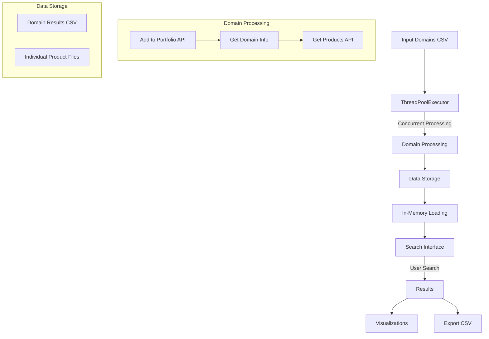
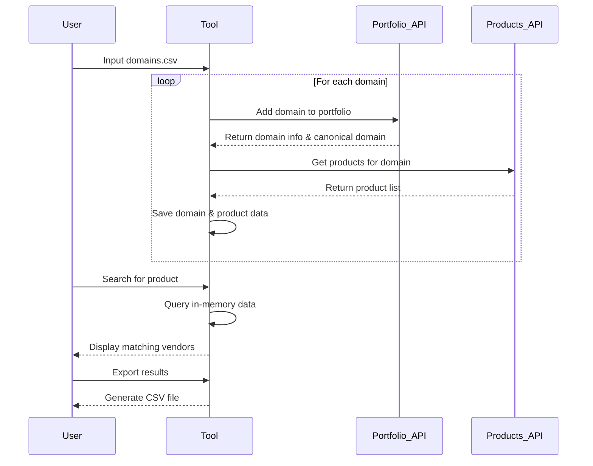
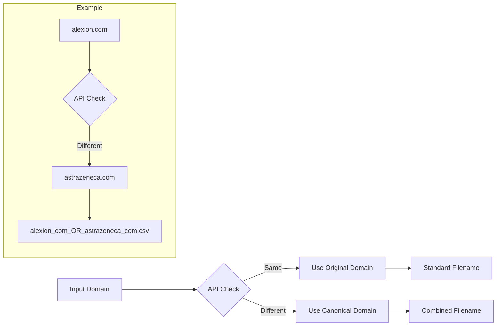

# SecurityScorecard Hackathon - Product Usage Search Tool

A tool to help find vendors or suppliers that might be affected by a product-related breach, vulnerability, or outage. Security teams can use this to identify which vendors are using specific products, helping them respond to security incidents.

**📒 Google Colab Demo:** [https://colab.research.google.com/drive/17b1AuK0IC8if8iQGcsyH1QnYfE8trjtH?usp=sharing](https://colab.research.google.com/drive/17b1AuK0IC8if8iQGcsyH1QnYfE8trjtH?usp=sharing)  
**▶️ Video Demo:** [https://streamable.com/voi8z3](https://streamable.com/voi8z3)


## Table of Contents
- [Overview](#overview)
- [Key Features](#key-features)
- [Performance Optimizations](#performance-optimizations)
  - [Concurrency](#concurrency)
  - [Memory Optimization](#memory-optimization)
  - [File Organization](#file-organization)
- [Usage Instructions](#usage-instructions)
  - [Prerequisites](#prerequisites)
  - [Required Python Libraries](#required-python-libraries)
  - [Setup](#setup)
  - [Input Domains File](#input-domains-file)
  - [Running the Tool](#running-the-tool)
  - [Search Interface](#search-interface)
  - [Export Functionality](#export-functionality)
- [Technical Details](#technical-details)
  - [Canonical Domain Resolution](#canonical-domain-resolution)
  - [API Integration](#api-integration)
  - [Data Processing Pipeline](#data-processing-pipeline)
  - [Data Pipeline Visualization](#data-pipeline-visualization)
  - [API Integration Flow](#api-integration-flow)
  - [Canonical Domain Resolution Process](#canonical-domain-resolution-process)
- [Error Handling](#error-handling)
  - [Common Issues and Solutions](#common-issues-and-solutions)
- [Visualization Capabilities](#visualization-capabilities)
- [Use Cases](#use-cases)
  - [Incident Response](#incident-response)
  - [Vendor Risk Management](#vendor-risk-management)
  - [Compliance and Reporting](#compliance-and-reporting)
- [Acknowledgements](#acknowledgements)

## Overview

The Product Usage Search Tool leverages SecurityScorecard's APIs to:

1. Collect vendor information from your portfolio
2. Detect products used by each vendor
3. Provide a real-time search interface to find vendors using specific products
4. Generate visualizations and statistics on product usage across your vendor ecosystem

## Key Features

- **Vendor Portfolio Integration**: Automatically adds domains to your SecurityScorecard portfolio
- **Product Detection**: Identifies products used by each vendor through SecurityScorecard's vendor detection API
- **Canonical Domain Resolution**: Handles parent-subsidiary relationships (e.g., alexion.com → astrazeneca.com)
- **Real-time Search**: Instantly search across all vendor product data
- **Data Visualization**: View charts and statistics about product usage across your vendor base
- **Export Capability**: Export search results for further analysis or reporting

## Performance Optimizations

### Concurrency

- **Multi-threaded Processing**: Uses Python's `concurrent.futures.ThreadPoolExecutor` to process multiple domains simultaneously
- **Configurable Thread Pool**: Adjust `max_workers` parameter to optimize for your system's capabilities
- **Progress Tracking**: Real-time progress bar using `tqdm` to monitor processing status

### Memory Optimization

- **In-Memory Data Caching**: Loads all product data into RAM for fast searching
- **Efficient Data Structures**: Uses pandas DataFrames for data manipulation and filtering
- **Lazy Loading**: Only processes and loads data when needed

### File Organization

- **Structured Output**: Organizes results in dedicated directories:
  - `/output`: Contains domain check results
  - `/products`: Stores individual product data files per domain
- **Timestamped Files**: All output files include timestamps for easy tracking

## Usage Instructions

### Prerequisites

- Python 3.x
- Jupyter Notebook environment
- SecurityScorecard API token

### Required Python Libraries

```
requests
pandas
matplotlib
tqdm
ipywidgets
python-dotenv
```

### Setup

1. Ensure you have a valid SecurityScorecard API token
2. Create a `.env` file with your API credentials:
   - Copy `.env.example` to `.env`
   - Update with your actual API token and portfolio ID
3. Install the required `python-dotenv` package:
   ```
   pip install python-dotenv
   ```
4. Prepare a CSV file with vendor domains (one domain per line)

### Input Domains File

> **Disclaimer**: The included `input_domains.csv` file contains the top 300 IT suppliers globally as a sample dataset.

The `input_domains.csv` file is a flexible data source that can contain:

- **Your Vendor Portfolio**: Domains of all vendors in your SecurityScorecard portfolio
- **Supply Chain Partners**: A list of your suppliers, vendors, or business partners
- **Critical Vendors**: A subset of high-risk or critical vendors you want to monitor
- **Industry Peers**: Companies in your industry for competitive analysis
- **Custom Lists**: Any group of companies you want to analyze together

This flexibility allows you to use the tool for various use cases:
- Analyzing your entire vendor ecosystem
- Focusing on specific vendor categories or tiers
- Performing targeted analysis during incident response
- Comparing product usage across different vendor groups

The file should contain one domain per line in the first column. Additional columns are ignored.

### Running the Tool

1. Open the `Product_Usage_Search_Tool.ipynb` notebook in Jupyter
2. Run all cells to initialize the environment
3. The tool will:
   - Process domains from your input file
   - Collect product data for each domain
   - Load all data into memory
   - Present a search interface

### Search Interface

The interactive search interface allows you to:

- Type product names to search across all vendors
- Toggle case sensitivity
- View matching results in real-time
- See usage statistics and visualizations
- Export results to CSV

### Export Functionality

The tool lets you save search results for further analysis:

1. **Export Process**:
   - Click the "Export Results" button after performing a search
   - The tool automatically generates a CSV file named `{search_term}_results.csv` in the current directory
   - A confirmation message displays the number of results exported and the filename

2. **Export File Contents**:
   - **domain**: The vendor domain name
   - **product**: The specific product that matched your search term
   - **product_count**: The number of matching products for this vendor
   - **file**: Reference to the source data file for traceability

3. **Data Integration**:
   - Export files are standard CSV format compatible with:
     - Excel for further analysis
     - PowerBI or Tableau for visualization
     - SIEM systems for correlation with security events
     - GRC platforms for risk management

4. **Use Cases for Exported Data**:
   - Create formal reports for management or clients
   - Track vendor remediation progress over time
   - Perform deeper analysis with additional data sources
   - Share findings with security teams or vendors

## Technical Details

### Canonical Domain Resolution

The tool uses SecurityScorecard's domain resolution system to handle parent-subsidiary relationships and acquisitions:

#### How It Works

1. **Input Domain Processing**:
   - When you provide a domain like `alexion.com` in your input file
   - The tool submits this to SecurityScorecard's API
   - The API may return a canonical domain like `astrazeneca.com` (parent company)

2. **Filename Generation**:
   - If input domain ≠ response domain, the tool creates a filename that preserves both:
     - `alexion_com_OR_astrazeneca_com_timestamp.csv`
   - This maintains the relationship between your input and the canonical domain

3. **Benefits**:
   - **Accurate Corporate Mapping**: Properly associates subsidiaries with parent companies
   - **Deduplication**: Prevents duplicate entries for the same corporate entity
   - **Historical Tracking**: Maintains relationships even after acquisitions or rebranding
   - **Complete Coverage**: Ensures you don't miss products due to domain variations

4. **Real-World Examples**:
   - `alexion.com` → `astrazeneca.com`
   - `yahoo.com` → `yahooinc.com`

This feature helps when analyzing vendor ecosystems where corporate relationships aren't always obvious.

### API Integration

The tool uses two main SecurityScorecard API endpoints:

1. **Portfolio API**: `https://api.securityscorecard.io/portfolios/{PORTFOLIO_ID}/companies/{domain}`
   - Adds companies to your portfolio
   - Retrieves company information (name, score, grade, industry, size)
   - Handles canonical domain resolution

2. **Vendor Detection API**: `https://api.securityscorecard.io/vendor-detection/{domain}/products`
   - Retrieves products used by each company

### Data Processing Pipeline

1. **Data Collection**:
   - Read domains from input CSV
   - Add each domain to portfolio
   - Retrieve product data for each domain

2. **Data Storage**:
   - Save domain information to CSV
   - Save product data to individual files

3. **Data Loading**:
   - Load all product data into memory
   - Create indexed DataFrame for efficient searching

4. **Search and Analysis**:
   - Filter data based on search terms
   - Generate statistics and visualizations
   - Export results as needed

### Data Pipeline Visualization



### API Integration Flow



### Canonical Domain Resolution Process



## Error Handling

- **Exception Handling**: Catches and logs errors during processing
- **Fault Tolerance**: Continues processing even if individual domains fail
- **Error Logging**: Keeps an error log file for troubleshooting

### Common Issues and Solutions

#### Environment Variables Configuration

If you encounter errors related to missing API credentials:

1. Make sure you've created a `.env` file in the project root directory
2. Verify that your `.env` file contains the correct variables:
   ```
   SSC_API_TOKEN=your_actual_token_here
   SSC_PORTFOLIO_ID=your_actual_portfolio_id_here
   ```
3. Ensure you've installed the `python-dotenv` package:
   ```
   pip install python-dotenv
   ```
4. If using a different environment variable naming scheme, update the `env_config.py` file accordingly

#### UnicodeEncodeError When Writing CSV

If you encounter this error:
```
UnicodeEncodeError: 'charmap' codec can't encode characters in position X-Y: character maps to <undefined>
```

This happens when writing non-ASCII characters to CSV files using the default encoding. To fix it, modify the CSV file opening line to specify UTF-8 encoding:

```python
# Change this line:
with open(output_csv_path, 'w', newline='') as output_file:

# To this:
with open(output_csv_path, 'w', newline='', encoding='utf-8') as output_file:
```

Also update any other file opening operations in the code:
```python
with open(products_path, 'w', newline='', encoding='utf-8') as products_file:
```

This ensures proper handling of international characters in company names and other data.

## Visualization Capabilities

- **Bar Charts**: Shows top suppliers using a specific product
- **Pie Charts**: Displays percentage of suppliers using a product
- **Summary Metrics**: Provides key statistics in an easy-to-read format

## Use Cases

### Incident Response

When a critical vulnerability or breach is announced for a specific product:
1. Search for the affected product name
2. Instantly identify which of your vendors are using it
3. Prioritize outreach based on vendor criticality
4. Track remediation progress over time

### Vendor Risk Management

- Identify technology concentration risks in your supply chain
- Discover which vendors are using outdated or vulnerable technologies
- Compare technology stacks across vendors in the same category
- Validate vendor security questionnaire responses against detected products

### Compliance and Reporting

- Generate reports on technology usage across your vendor ecosystem
- Document third-party dependencies for compliance requirements
- Track changes in vendor technology usage over time
- Provide evidence for audit and assessment processes

## Acknowledgements

- SecurityScorecard API Team for providing the necessary endpoints
- Hackathon organizers and participants for feedback and support
